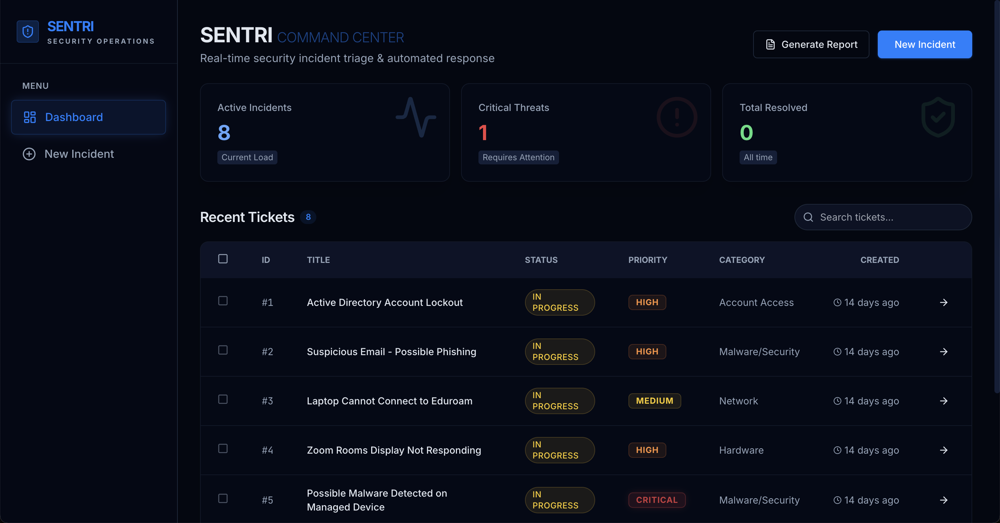

# Sentri

**Sentri** is an AI-powered operations automation tool that eliminates manual ticket triage. Submit an incident and GPT-4o instantly classifies it, sets priority, generates enterprise-grade next steps tied to real tools (ADUC, Event ID 4740, M365 Admin Center), and drafts a professional response — turning hours of manual ops work into seconds.

## Live demo

Sentri is live on Railway:

- **App**: https://sentri.up.railway.app

## Screenshot



## Key features

- **Ticket management** — Create, view, update, and track tickets with status and priority
- **AI-powered analysis** — Automatic category, priority, 8–10 numbered next steps, and a draft response per ticket (OpenAI)
- **Tool-specific guidance** — Next steps reference real enterprise tools by incident type (e.g. ADUC, Event ID 4740, Microsoft 365 Admin Center, Exchange Admin Center)
- **Bulk analysis** — Analyze multiple tickets at once with configurable concurrency
- **Impact tracking** — Bulk analysis reports estimated time saved per ticket (6–21 min depending on category and priority), giving a concrete ROI signal for each automation run
- **Professional drafts** — Model-generated replies that address the user by name, explain IT actions, ask clarifying questions, and sign off as IT Support Team
- **Dashboard** — Overview of active tickets, critical count, resolved today, and quick actions

## Tech stack

| Layer      | Technology |
|-----------|------------|
| Frontend  | React 18, Vite, TypeScript, Tailwind CSS, Radix UI, TanStack Query, Wouter |
| Backend   | Node.js, Express 5, TypeScript |
| Database  | PostgreSQL (Drizzle ORM) |
| AI        | OpenAI API (gpt-4o) for ticket analysis |
| Deploy    | Railway |

## Getting started

### Prerequisites

- Node.js 20+
- PostgreSQL (e.g. [Neon](https://neon.tech) for a free cloud DB)

### Install and run locally

1. **Clone and install**
   ```bash
   git clone https://github.com/anthonyhastaba/Sentri.git
   cd Incident-Triage-Hub
   npm install
   ```

2. **Environment**  
   Create a `.env` file in the project root (see [Environment variables](#environment-variables)). Never commit `.env`.

3. **Database**
   ```bash
   npm run db:push
   ```

4. **Development server**
   ```bash
   npm run dev
   ```
   Open http://localhost:5000 (or the `PORT` you set).

### Build and production

- **Build:** `npm run build` (client → `dist/public/`, server → `dist/index.cjs`)
- **Start:** `npm start` (uses `PORT`; Railway sets this automatically)

### Environment variables

| Variable           | Required | Description |
|--------------------|----------|-------------|
| `DATABASE_URL`     | Yes      | PostgreSQL connection string |
| `OPENAI_API_KEY`   | No       | Enables AI ticket analysis; app runs without it |
| `PORT`             | No       | Server port (default 5000) |

For production (e.g. Railway), set these in your host’s environment or Variables UI.

## Testing

31 tests covering storage-layer contract tests and HTTP integration tests (Vitest + supertest).

```bash
npm run test          # run once
npm run test:watch    # watch mode
```

## License

MIT
